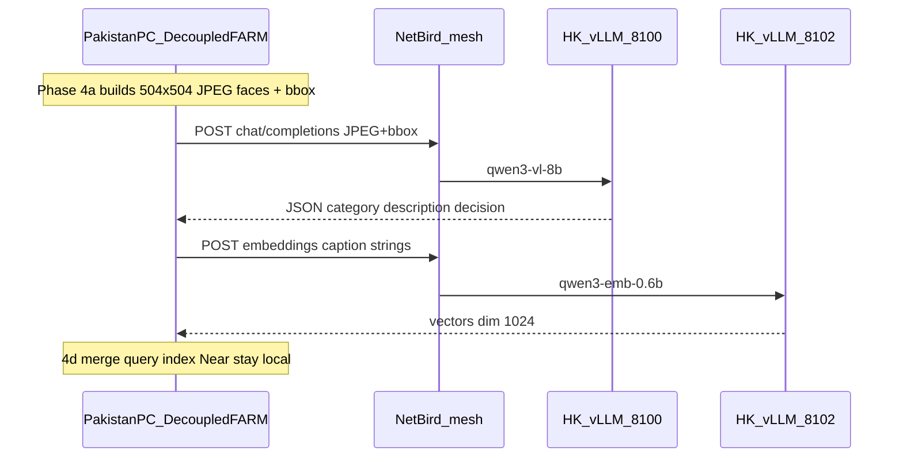

# Decoupled-FARM ↔ HK spatial-gpt (remote VLM + embedder)

This document describes the **production HK inference stack** that replaces Gemini for **Decoupled-FARM Phase 4** (construction-site object captioning + text embedding). It is written for:

1. **Pakistan developers / Cursor agents** wiring `phase4-visual-query` to call HK over NetBird.
2. **HK operators** maintaining the GPU box at `/home/kodifly/spatial-gpt`.

Copy this file into the FARM repo (e.g. `Decoupled-FARM/docs/HK_VLLM_REMOTE.md`) so Pakistan-side tooling has a single source of truth.

---

## 1. What this is (and is not)

### HK box (`spatial-x-server`, `/home/kodifly/spatial-gpt`)

A **stateless OpenAI-compatible vLLM pair** on one RTX 4090:

| Role | Model (HF) | Served name | Endpoint |
|------|------------|-------------|----------|
| Caption VLM | `Qwen/Qwen3-VL-8B-Instruct-FP8` | `qwen3-vl-8b` | `http://100.109.254.4:8100/v1` |
| Text embedder | `Qwen/Qwen3-Embedding-0.6B` | `qwen3-emb-0.6b` | `http://100.109.254.4:8102/v1` |

**Input → output:**

- Caption: **one JPEG face** (typically 504×504) + **bbox tag** → strict JSON (`keep` / `drop` + category/description).
- Embed: **caption text string(s)** → **1024-dim** float vectors (L2-normalized by the model).

No images are stored on HK. No scene state. No 7k-object batch storage. Each HTTP request is independent.

### Pakistan PC (`sarim-pc`, Decoupled-FARM)

Keeps **everything else**:

- Video, Stella `out.db`, DA3 depths, SAM3, Phase 3/3.5 geometry
- Phase 4a face/crop generation, 4d merge, query graph execution (Near/NextTo in XYZ)
- Viser viewer, experiment outputs

Pakistan **calls HK only** for Phase 4b caption + Phase 4c embed (today via `gemini_client.py`; target: vLLM backend with the same interface).

### Explicitly NOT on HK

- Stella, SAM3, Phase 3, Decoupled-FARM pipeline execution
- Old welding VLM (`vlm-api-qwen25vl.service`, port 8090, Qwen2.5-VL video API)
- Extra models (Qwen3-VL-Embedding-2B, SigLIP2, Qwen3.5-9B) — they do not fit with the 8B VL on one 4090

---

## 2. Architecture



```text
┌─────────────────────────────────────────────────────────────────┐
│  Pakistan (100.109.101.169) — Decoupled-FARM                    │
│  ┌──────────────┐   JPEG+bbox    ┌──────────────────────────┐ │
│  │ Phase 4a     │──────────────►│ phase4b caption (client) │ │
│  │ faces/crops  │               │ phase4c embed   (client) │ │
│  └──────────────┘               └────────────┬─────────────┘ │
│  scene_state.pt, merge, query               │ HTTP + Bearer  │
└─────────────────────────────────────────────┼────────────────┘
                                              │ NetBird only
┌─────────────────────────────────────────────┼────────────────┐
│  HK (100.109.254.4) — spatial-gpt           ▼                │
│  ┌─────────────────────┐    ┌─────────────────────┐          │
│  │ vLLM :8100          │    │ vLLM :8102          │          │
│  │ Qwen3-VL-8B FP8     │    │ Qwen3-Emb 0.6B      │          │
│  │ gpu util 0.70       │    │ runner pooling 0.15 │        │
│  └─────────────────────┘    └─────────────────────┘          │
│  RTX 4090 24GB · weights in ~/.cache/huggingface             │
└─────────────────────────────────────────────────────────────────┘
```

---

## 3. Network and security

### Hosts (NetBird overlay — not public WAN)

| Host | Role | NetBird IP | FQDN (do not use for API) |
|------|------|------------|---------------------------|
| HK GPU server | vLLM inference | **`100.109.254.4`** | `spatialx-backend-hk-office-kodifly-z790-aorus-elite-ax.netbird.cloud` |
| Pakistan PC | Pipeline client | **`100.109.101.169`** | `sarim-pc.netbird.cloud` |

Both are in `100.109.0.0/16`. **NetBird DNS is not configured** (`Nameservers: 0/0`). Clients **must** use `http://100.109.254.4:<port>`, not the FQDN.

### Ports (important — not the original plan’s 8000/8002)

The original brief used **8000 / 8002**. On this HK host those ports are **already taken**:

| Port | Existing service |
|------|------------------|
| 8000 | `spatialx-backend-web` (Docker) |
| 8002 | `kodifly-data-broker` (Daphne) |

**Production vLLM ports:**

| Port | Service |
|------|---------|
| **8100** | Caption VLM |
| **8102** | Text embedder |

Do **not** port-forward 8100/8102 on the office router. Access is **NetBird-only** (+ HK UFW/iptables rules for the mesh).

### Authentication

Both vLLM processes share one API key (`VLLM_API_KEY` in HK `/home/kodifly/spatial-gpt/.env`).

Every request:

```http
Authorization: Bearer <VLLM_API_KEY>
```

Missing or wrong key → **401** (fast). Connection **timeout** → network/firewall, not auth.

### Firewall (HK) — required for Pakistan TCP

UFW alone was **not sufficient** for NetBird → host services on 8100/8102. Pakistan could reach **8080** and **22** but **8100 timed out** until these **iptables** rules were added on HK:

```bash
sudo iptables -I INPUT 1 -i wt0 -p tcp -s 100.109.0.0/16 --dport 8100 -j ACCEPT
sudo iptables -I INPUT 1 -i wt0 -p tcp -s 100.109.0.0/16 --dport 8102 -j ACCEPT
```

Also keep UFW rules (already added):

```bash
sudo ufw allow from 100.109.0.0/16 to any port 8100 proto tcp
sudo ufw allow from 100.109.0.0/16 to any port 8102 proto tcp
```

**Note:** iptables rules may not survive reboot unless persisted (`iptables-save` / netfilter-persistent). Re-apply after reboot if Pakistan loses access.

### Connectivity checklist (from Pakistan)

```bash
netbird status                    # Management + Signal Connected
ping -c 3 100.109.254.4           # ~230–250 ms RTT is normal
nc -zv -w 5 100.109.254.4 8100    # must succeed
nc -zv -w 5 100.109.254.4 8102    # must succeed
```

**SSH tunnel workaround** (if firewall regresses; port 22 works):

```bash
ssh -N -L 8100:127.0.0.1:8100 -L 8102:127.0.0.1:8102 kodifly@100.109.254.4
# then use http://127.0.0.1:8100/v1 on Pakistan
```

---

## 4. Pakistan client configuration

Set these in the shell, `.env`, or Decoupled-FARM config **before Phase 4b/4c**:

```bash
export VLLM_BASE_URL=http://100.109.254.4:8100/v1
export VLLM_EMBED_BASE_URL=http://100.109.254.4:8102/v1
export VLLM_API_KEY=<same value as HK spatial-gpt/.env>
```

Optional overrides (defaults match HK):

```bash
export VLLM_VL_MODEL=qwen3-vl-8b          # served model id for caption
export VLLM_EMBED_MODEL=qwen3-emb-0.6b    # served model id for embed
export VLLM_DISABLE_THINKING=1              # Qwen3 thinking off (match HK server)
```

### Integration target (Pakistan repo — not yet implemented on HK)

Extend [`phase4-visual-query/gemini_client.py`](../Decoupled-FARM/phase4-visual-query/gemini_client.py) (or add `vllm_client.py`) with the **same public interface**:

| Method | Gemini today | vLLM target |
|--------|--------------|-------------|
| `caption_image(image_path, user_prompt)` | Gemini multimodal JSON | `POST /v1/chat/completions` |
| `embed_texts(texts: list[str])` | Gemini embedding | `POST /v1/embeddings` |
| `parse_json_text(system, user)` | Gemini text JSON | `POST /v1/chat/completions` (text only) |

Backend selection via env: if `VLLM_BASE_URL` is set, use vLLM; else Gemini (`GOOGLE_API_KEY`).

Reference implementation patterns exist in FARM under `farm_src/src/scene_graph/llm_utils/` (`llm_config.py`, `llm_interface.py`, `embed_interface.py`) — same OpenAI-compatible shape.

---

## 5. API reference (OpenAI-compatible)

Base URLs:

- Caption / text JSON: `http://100.109.254.4:8100/v1`
- Embeddings: `http://100.109.254.4:8102/v1`

### 5.1 Health / model list

```bash
curl -H "Authorization: Bearer $VLLM_API_KEY" \
  http://100.109.254.4:8100/v1/models

curl -H "Authorization: Bearer $VLLM_API_KEY" \
  http://100.109.254.4:8102/v1/models
```

Expected model ids: `qwen3-vl-8b`, `qwen3-emb-0.6b`.

### 5.2 Caption — `POST /v1/chat/completions`

**Visual input:** one **JPEG** (not PNG-required, not mp4). Typical Phase 4a **full perspective face** at **504×504**, ~40–80 KB. **Not** a tight SAM crop unless falling back.

**Targeting:** user message includes FARM bbox in **normalized 0–1000** coordinates:

```text
TARGET BOUNDING BOX: <box>(x1,y1),(x2,y2)</box>
```

Coordinates refer to pixels in the image; values are 0–999 after scaling (see `format_bbox_tag` in FARM `prompts.py`).

**Request body (minimal):**

```json
{
  "model": "qwen3-vl-8b",
  "temperature": 0.0,
  "max_tokens": 512,
  "messages": [
    {
      "role": "system",
      "content": "<contents of prompts/caption_system.txt on HK>"
    },
    {
      "role": "user",
      "content": [
        {
          "type": "text",
          "text": "NEW INPUT:\nINPUT VIEWS: 1 full perspective view of the construction site.\nImage size: 504×504 pixels.\nTARGET BOUNDING BOX: <box>(120,80),(410,390)</box>\nIdentify the target object inside the bounding box on this construction site.\nPreferred site vocabulary (when confident): construction debris, rebar, shipping container, ...\n\nReturn the strict JSON object only."
        },
        {
          "type": "image_url",
          "image_url": {
            "url": "data:image/jpeg;base64,<BASE64_JPEG_BYTES>"
          }
        }
      ]
    }
  ],
  "response_format": {
    "type": "json_schema",
    "json_schema": {
      "name": "construction_caption",
      "strict": true,
      "schema": { }
    }
  },
  "chat_template_kwargs": {
    "enable_thinking": false
  }
}
```

Use the full schema from HK [`prompts/caption_schema.json`](../prompts/caption_schema.json) (also mirrored in FARM `farm_src/.../structured.py` as `CAPTION_SCHEMA`).

**Required response JSON:**

```json
{
  "category": "string",
  "supercategory": "string",
  "attributes": ["string"],
  "description": "string",
  "decision": "keep"
}
```

- `decision` ∈ `{ "keep", "drop" }` only.
- On **drop**, exactly:

```json
{
  "category": "unknown",
  "supercategory": "unknown",
  "attributes": [],
  "description": "",
  "decision": "drop"
}
```

**Supercategories** (from system prompt):  
`heavy equipment, temporary works, container, vehicle, structure, material, PPE, tool, fixture, signage, vegetation, safety equipment, other, unknown`

**Concurrency:** send **many parallel HTTP requests** (e.g. batch 8). vLLM continuous batching handles concurrency (`--max-num-seqs 8`). Do **not** serialize with a global semaphore of 1.

**Latency:** ~0.3–2 s per image when batched; ~230 ms network RTT PK↔HK on top.

### 5.3 Embed — `POST /v1/embeddings`

Embed **caption text only** — typically the `description` field, optionally `"category. description"`. No images.

```json
{
  "model": "qwen3-emb-0.6b",
  "input": [
    "blue corrugated shipping container",
    "rusty cylindrical rebar cage"
  ]
}
```

**Response:** OpenAI embedding shape; each vector length **1024** (not Gemini 768). FARM accepts any dim ≥ 128.

### 5.4 Optional query parse (text only)

Same port **8100**, no image. System prompt: HK `prompts/query_parser_system.txt` (mirrors FARM `QUERY_PARSER_SYSTEM`).

Supported predicates in FARM execution: **Near, NextTo, Closest, Farthest, On, Above, Below, IsCategory, HasAttribute**.  
Do **not** advertise LeftOf/RightOf/InFrontOf (cuboid 360; unimplemented).

Pakistan may keep parsing local; prompts on HK exist for parity.

---

## 6. Prompt and vocab contract (must match FARM Phase 4)

HK stores canonical copies under `/home/kodifly/spatial-gpt/prompts/` and `data/`. They were extracted from Decoupled-FARM Phase 4 — **byte-level parity with FARM `prompts.py` is required** for consistent captions.

| File | Purpose |
|------|---------|
| `prompts/caption_system.txt` | System prompt: keep/drop rules, supercategories, JSON schema description, examples |
| `prompts/caption_user_template.txt` | User template with `{width}`, `{height}`, `{bbox_tag}`, `{vocab_hint}` |
| `prompts/caption_schema.json` | JSON Schema for guided decoding |
| `prompts/query_parser_system.txt` | Spatial query parser (optional) |
| `data/construction_vocab.txt` | 48-line site vocab hint (not a closed class list) |

**User template** (fill before send):

```text
NEW INPUT:
INPUT VIEWS: 1 full perspective view of the construction site.
Image size: {width}×{height} pixels.
TARGET BOUNDING BOX: {bbox_tag}
Identify the target object inside the bounding box on this construction site.
Preferred site vocabulary (when confident): {vocab_hint}

Return the strict JSON object only.
```

Build `{bbox_tag}` with FARM `format_bbox_tag(bbox_xyxy, image_width=504, image_height=504)`.

Build `{vocab_hint}` from first ~40 lines of `construction_vocab.txt`, comma-separated (see FARM `load_vocab_hint`).

---

## 7. HK server layout and ops

### Directory structure

```text
/home/kodifly/spatial-gpt/
├── README.md
├── docs/
│   └── FARM_HK_VLLM_INTEGRATION.md    ← this file
├── .env                               ← secrets (gitignored): VLLM_API_KEY, HF_TOKEN, ports
├── .env.example
├── .gitignore
├── requirements.txt                   ← vllm==0.14.0 (CUDA 12.9 pin)
├── prompts/                           ← Phase 4 prompt assets
├── data/construction_vocab.txt
├── scripts/
│   ├── serve_vlm.sh                   ← start caption server
│   ├── serve_embed.sh                 ← start embed server
│   ├── smoke_caption.py
│   └── smoke_embed.py
├── systemd/
│   ├── spatial-gpt-vlm.service
│   └── spatial-gpt-embed.service
├── logs/                              ← optional; journalctl also used
├── .venv/                             ← Python 3.12 + vLLM
└── Decoupled-FARM/                    ← read-only reference clone (gitignored)
```

Model weights: **`~/.cache/huggingface`** (not in repo).

### Runtime stack (HK-specific pins)

| Component | Version / note |
|-----------|----------------|
| GPU | RTX 4090 24 GB, driver 575, CUDA 12.9 |
| Python | 3.12 (`uv venv`) |
| vLLM | **0.14.0** (0.27+ needs CUDA 13 — broken on this driver) |
| PyTorch | cu128 via `uv pip install --torch-backend cu128` |
| Caption model | `Qwen/Qwen3-VL-8B-Instruct-FP8` |
| Embed model | `Qwen/Qwen3-Embedding-0.6B`, `--runner pooling` |

### vLLM serve flags (reference)

**Caption** (`scripts/serve_vlm.sh`):

- `--host 0.0.0.0` (listen all interfaces; UFW/iptables restrict NetBird)
- `--port 8100`
- `--served-model-name qwen3-vl-8b`
- `--max-model-len 4096`
- `--max-num-seqs 8`
- `--gpu-memory-utilization 0.70`
- `--limit-mm-per-prompt '{"image": 1}'`
- `--default-chat-template-kwargs '{"enable_thinking": false}'`
- `--api-key "$VLLM_API_KEY"`

**Embed** (`scripts/serve_embed.sh`):

- `--host 0.0.0.0`
- `--port 8102`
- `--runner pooling`
- `--max-model-len 512`
- `--gpu-memory-utilization 0.15`
- `--api-key "$VLLM_API_KEY"`

Start **embedder first**, then VLM (shared GPU). Leave unrelated GPU processes alone unless OOM; then lower VLM util toward `0.60`.

### systemd (user units, linger enabled)

```bash
systemctl --user status spatial-gpt-embed.service spatial-gpt-vlm.service
journalctl --user -u spatial-gpt-vlm -u spatial-gpt-embed -f
systemctl --user restart spatial-gpt-embed.service spatial-gpt-vlm.service
```

Units live in `~/.config/systemd/user/` (copied from `spatial-gpt/systemd/`).

### Do not run alongside

- `vlm-api-qwen25vl.service` (8090, Qwen2.5-VL welding API)
- Training jobs or extra large models on the same 4090

---

## 8. Pakistan Phase 4 flow (how pieces connect)

1. **Phase 4a** (local): build `504×504` JPEG **faces** per object + pixel bboxes.
2. **Phase 4b** (remote caption): for each face, call HK `chat/completions` → parse JSON → write `caption`, `decision`, etc. into `scene_state`.
3. **Phase 4c** (remote embed): embed kept objects’ `description` strings → store vectors for retrieval (dim **1024**).
4. **Phase 4d merge** (local): merge captions into scene graph.
5. **Query** (local): Near/NextTo/etc. in XYZ; optional embed of query text via same embed endpoint.

**Image contract reminders:**

- JPEG face, full perspective view, **not** equirect, **not** mp4.
- Bbox in user text as `<box>(x1,y1),(x2,y2)</box>` normalized 0–1000.
- Temperature **0.0** for caption.

---

## 9. Example Python client (Pakistan / agent reference)

Minimal caption call (no FARM dependency):

```python
import base64
import json
import os
import urllib.request

BASE = os.environ["VLLM_BASE_URL"].rstrip("/")
KEY = os.environ["VLLM_API_KEY"]

def caption_jpeg(jpeg_bytes: bytes, user_text: str, system_text: str, schema: dict) -> dict:
    b64 = base64.b64encode(jpeg_bytes).decode("ascii")
    payload = {
        "model": "qwen3-vl-8b",
        "temperature": 0.0,
        "max_tokens": 512,
        "messages": [
            {"role": "system", "content": system_text},
            {
                "role": "user",
                "content": [
                    {"type": "text", "text": user_text},
                    {"type": "image_url", "image_url": {"url": f"data:image/jpeg;base64,{b64}"}},
                ],
            },
        ],
        "response_format": {
            "type": "json_schema",
            "json_schema": {"name": "construction_caption", "strict": True, "schema": schema},
        },
        "chat_template_kwargs": {"enable_thinking": False},
    }
    req = urllib.request.Request(
        f"{BASE}/chat/completions",
        data=json.dumps(payload).encode(),
        headers={"Content-Type": "application/json", "Authorization": f"Bearer {KEY}"},
        method="POST",
    )
    with urllib.request.urlopen(req, timeout=120) as resp:
        body = json.loads(resp.read())
    return json.loads(body["choices"][0]["message"]["content"])


def embed_texts(texts: list[str]) -> list[list[float]]:
    base = os.environ["VLLM_EMBED_BASE_URL"].rstrip("/")
    payload = {"model": "qwen3-emb-0.6b", "input": texts}
    req = urllib.request.Request(
        f"{base}/embeddings",
        data=json.dumps(payload).encode(),
        headers={"Content-Type": "application/json", "Authorization": f"Bearer {KEY}"},
        method="POST",
    )
    with urllib.request.urlopen(req, timeout=60) as resp:
        body = json.loads(resp.read())
    return [row["embedding"] for row in body["data"]]
```

HK smoke scripts: `scripts/smoke_caption.py`, `scripts/smoke_embed.py` (same contract).

---

## 10. Troubleshooting

| Symptom | Likely cause | Fix |
|---------|--------------|-----|
| `curl` **timeout** from PK | HK firewall / iptables | Apply `wt0` iptables rules (§3); verify `nc -zv 100.109.254.4 8100` |
| **ping OK**, TCP timeout | Same | iptables on `wt0` for 8100/8102 |
| **401** from curl | Wrong/missing Bearer token | Match `VLLM_API_KEY` to HK `.env` |
| **connection refused** on 8100 | vLLM not running | `systemctl --user status spatial-gpt-vlm.service` on HK |
| Works on HK, not PK | NetBird down on either side | `netbird status` both hosts |
| OOM on HK | GPU memory | Lower `--gpu-memory-utilization` on VLM; restart embed then vlm |
| Empty / thinking tokens in caption | Qwen3 thinking on | Server has `enable_thinking: false`; client should too |
| Wrong port | Using 8000/8002 | Use **8100 / 8102** |

**Diagnostic interpretation (Pakistan `nc`):**

- **8080 / 22 succeed**, **8100 timeout** → HK host firewall dropping those ports (not PK).
- **11434 refused** → path open, nothing listening (proves TCP reaches HK).

---

## 11. Cursor agent brief (Pakistan)

When implementing or running Phase 4 against HK:

1. Require NetBird connected on Pakistan (`100.109.101.169`).
2. Set `VLLM_BASE_URL`, `VLLM_EMBED_BASE_URL`, `VLLM_API_KEY` (see §4).
3. Use ports **8100** and **8102**, IP **`100.109.254.4`**, not FQDN.
4. Caption: JPEG face + `caption_system.txt` + user template + `caption_schema.json`.
5. Embed: text only; expect **1024** dimensions.
6. Parallelize caption requests (batch ~8); do not use Semaphore(1).
7. Do not send mp4, equirect, or store data on HK.
8. Implement vLLM backend in `gemini_client.py` (or sibling) matching existing `caption_image` / `embed_texts` signatures.

---

## 12. Changelog vs original plan (`plan.md`)

| Original plan | As deployed |
|---------------|-------------|
| Ports 8000 / 8002 | **8100 / 8102** (8000/8002 taken on HK) |
| Bind `100.109.254.4` only | Bind **`0.0.0.0`** + UFW/iptables restrict NetBird |
| vLLM latest | **vLLM 0.14.0** (CUDA 12.9 driver limit) |
| UFW only | UFW + **iptables `-i wt0`** rules required |
| PK clones prompts from desktop path | Prompts on HK under `spatial-gpt/prompts/` |

---

*Last verified: Pakistan `nc` + `curl /v1/models` to both endpoints successful over NetBird.*
