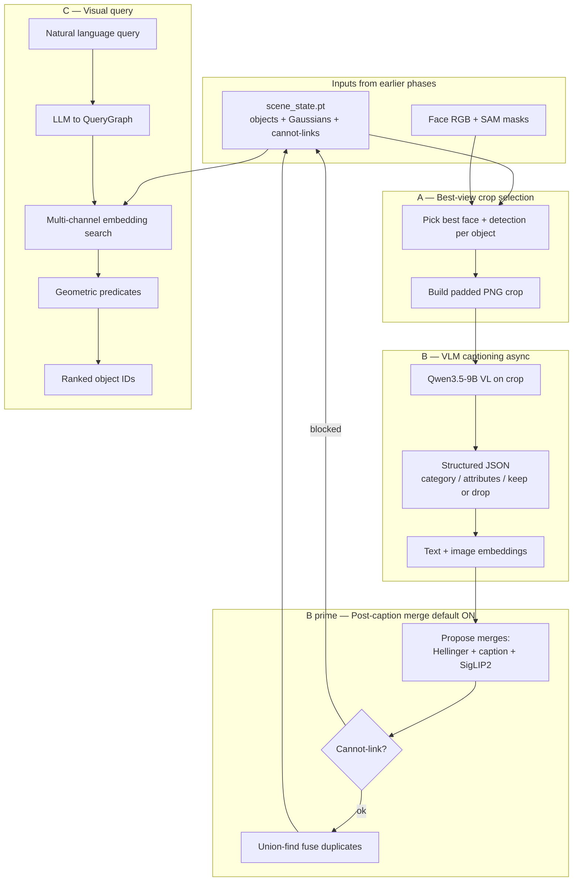

# FARM Phase 4+ — Captioning, Grounding & Relational Retrieval

**Purpose:** Explain how FARM turns a 3D object map into a language-enriched, queryable scene memory — written so you can follow the full flow **without prior FARM context**.

**Audience:** Engineers implementing our Gemini-based Phase 4b+ (SX-3791–3794) or reviewing how FARM’s design choices differ from our SAM3 pipeline.

**Code (vendored):** `farm_src/src/scene_graph/`  
**Our Phase 4a (crops only, no VLM yet):** `phase4-caption-best-view/`  
**Related Jira:** [SX-3786](https://kodiflylimited.atlassian.net/browse/SX-3786) · subtasks SX-3791–3794  
**Companion doc (fragmentation):** `docs/FRAGMENTATION_EXPERIMENTS.md`

---

## How to read this document

| Section | What you get |
|---------|--------------|
| **§1 Glossary** | Vocabulary used everywhere else |
| **§2 Starting point** | What exists *before* Phase 4 |
| **§2.4 Cuboid vs perspective** | How 360° face reprojection changes identity & retrieval |
| **§3 Cannot-link** | The identity constraint that blocks many merges |
| **§4 End-to-end flow** | Full pipeline from map → captions → queries |
| **§5–§8** | Each stage in depth (crops, captioning, merge, retrieval) |
| **§9 Identity hierarchy** | How Phase 3 merge, caption merge, and our coalescence relate |
| **§10 Our gap** | What we have vs what FARM has today |
| **§11 Gemini plan** | Practical first steps for our implementation |
| **§12 Reference** | Thresholds, file map, cheat sheet |

---

## 1. Glossary

| Term | Plain meaning |
|------|----------------|
| **Scene graph / scene state** | The live map: every tracked object’s 3D shape, appearance features, which camera views saw it, captions (once added), and identity constraints. Stored as `scene_state.pt`. |
| **Object** | One entry in the map — a persistent 3D instance with a stable **object id**. Not the same as a single SAM mask; one object can accumulate many detections over time. |
| **Detection** | One SAM/YOLO mask in one camera view at one moment. Many detections can fuse into one object across keyframes. |
| **Keyframe (KF)** | One stop along the 360° walk. Each KF has up to **4 cuboid faces** (perspective RGB images). |
| **Image id / face id** | `global_id = kf_index × 4 + face_index`. Identity rules are **per face**, not per whole keyframe. |
| **Gaussian** | Each object’s 3D footprint: a mean position + covariance (`means`, `cov6`). Used for “how close / overlapping are these objects?” |
| **Hellinger distance** | Statistical distance between two Gaussians. Low Hellinger ⇒ objects overlap or sit very close in 3D. |
| **Union-find** | Algorithm that groups objects into merge clusters. FARM uses it whenever two things might be the same physical instance. |
| **Must-link** | Explicit rule: “merge these — they are the same thing.” (Used in our fragmentation experiments.) |
| **Cannot-link** | Explicit rule: “never merge these — they were **different detections in the same photo**.” (Built automatically in Phase 3.) |
| **Crop** | A small PNG cut from a face image around one object’s mask — what the VLM actually sees. |
| **Caption** | Structured text label for an object: category, attributes, short description, keep/drop decision. |
| **Embedding** | Numeric vector summarizing caption text or crop image — used for “find objects like this query.” |
| **Query graph** | Parsed natural-language query: target description + spatial predicates (`Near`, `LeftOf`, …). |
| **RRF** | Reciprocal Rank Fusion — combines several embedding search rankings into one score. |

---

## 2. Starting point — what exists before Phase 4

Phase 4 does **not** build the map. It **enriches** a map that Phase 3 already created.

### 2.1 What Phase 3 produced

By the time captioning starts, each active object already has:

- **3D geometry** — Gaussian mean + covariance (and optionally voxels / Stella points in our pipeline)
- **Appearance** — DINOv3 (or similar) feature vector from detections
- **View history** — which face images contributed detections (`object_image_ids`, `detection_image_ids`)
- **Identity graph** — merges from online fusion + **`cannot_link_object_ids`** (see §3)
- **Redirect map** — if object B was merged into A, `id_redirect[B] → A`

Conceptually:

```
Many SAM masks (Phase 2)
        │
        ▼  Phase 3: "Are these the same thing seen again?"
        │           fuse geometry + features when gates pass
        │           record cannot-links when two masks share one photo
        ▼
Fewer persistent objects in scene_state.pt
        │
        ▼  Phase 4: "What is each object, in words?"
        │           crop → VLM caption → embeddings
        │           optional post-caption identity cleanup
        ▼
Language-enriched map ready for "find the red toolbox near the crane"
```

### 2.2 Why Phase 3 still leaves duplicates

Phase 3 merge is **conservative** and **local**:

- Detections must look similar (feature cosine) **and** have overlapping Gaussians (Hellinger)
- Centre distance is capped (~**1 m** in our pipeline)
- **Cannot-link** blocks many would-be merges (§3)
- SAM3 often segments **parts** (container door, crane boom) → separate objects that co-appear in one face

So Phase 4 starts with a map that is **geometrically coherent but linguistically empty**, and still has **duplicate small objects** and **fragmented large assets**.

### 2.3 Our 360° camera model (important for identity)

Each keyframe exposes **4 perspective faces** of a cuboid. FARM treats each face as its own “camera snapshot” for identity:

```
KF 12, face 0 (front)  → image_id = 48
KF 12, face 1 (right)  → image_id = 49
KF 12, face 2 (back)   → image_id = 50
KF 12, face 3 (left)   → image_id = 51
```

**Same object on two different faces** → allowed to merge over time.  
**Two different objects on the same face** → cannot-link forever.

### 2.4 Cuboid 360° vs FARM’s native perspective — what changes

FARM was built for a **robot with ordinary perspective RGB-D cameras**: one image, one pose, one intrinsics matrix. Our pipeline feeds FARM-compatible **pinhole face tiles**, but they are **reprojections from equirectangular 360° video**, not native captures.

```text
FARM (typical)                         Our pipeline
─────────────────                      ─────────────────────────────
1 camera pose per image                1 walk stop (KF) → 4 face images
Independent frames over time           Same position, 4 viewing directions
Native perspective capture             Equirect → 504×504 cuboid reprojection
1 image_id = 1 physical snapshot       1 KF = 4 image_ids (kf×4 + face)
```

Phase 2 onward treats each face as a standard perspective image (correct — pinhole math applies). The implications are **not** “rewrite Phase 4,” but **where identity, geometry, and view-dependent retrieval behave differently**.

#### What stays the same

| Workflow stage | Why unchanged |
|----------------|---------------|
| **VLM captioning on crops** | Still object-centric PNG crops, not equirect or full faces. Gemini MVP unchanged. |
| **Structured JSON schema** | keep/drop, category, attributes — independent of camera layout. |
| **Embedding RRF retrieval** | Cosine search over caption/crop vectors — camera-agnostic. |
| **Query parser (LLM text-only)** | Parses “red toolbox near the crane” without images. |
| **Metric predicates** (`Near`, `Above`, `Closest`) | Use world-frame Gaussians / Stella means — global coordinates. |
| **Post-caption merge logic** | Same gates (Hellinger + caption + SigLIP2 + cannot-link). Code path identical. |

#### What changes (and how)

**1. Cannot-link is per face, not per walk stop**

This is the biggest identity difference. At one keyframe position, four faces see overlapping world content from **different directions** but are **four separate image_ids**.

| Scenario | FARM (1 image) | Our cuboid (4 faces) |
|----------|----------------|----------------------|
| Chair + table, same snapshot | cannot-link | cannot-link **if same face** |
| Two container fragments, same face | cannot-link | cannot-link — **main fragmentation blocker** |
| Same object on face 0 and face 2 at one KF | N/A (one view) | **No** cannot-link → can merge if feature/Hellinger pass |
| Object spanning cube seam | N/A | Clipped into **two face detections** → often cannot-link on each face separately |

Phase 3+ caption merge **workflows do not change**; the **cannot-link graph is denser** because SAM3 fragments on a single face create permanent blocks. That is why our coalescence experiments (SX-3790) exist as a **separate post-hoc step** — FARM never needed them for robot perspective data at this scale.

**2. Cube seams and border clipping (Phases 2–3)**

Reprojection cuts objects at face edges. FARM’s border filter assumes border-touching = bad detection (`min_kept_num_pixels=4000`). We lowered it to **1000** because legitimate large assets (containers, walls) are clipped at seams (`phase3/filter.py`).

Implications:

- More part-level SAM masks at seams → more objects → more cannot-links
- Best-view crops may include **truncated objects** if the winning detection sits near a face edge
- **Captioning adaptation:** prefer central, non-border crops when ranking views (quality × edge-margin penalty — not in FARM default)

**3. Per-face depth scale (Phase 1.5 → 2)**

Each face gets depth from DA3 with a potentially **different scale factor α** per face. Adjacent faces of the same KF can unproject the same surface to slightly different world Z.

Implications:

- Hellinger overlap and the **1 m merge cap** can behave inconsistently at face boundaries
- World-space metric predicates are only as good as global scale alignment (Stella/DA3 audit issue)
- **Does not change** caption or embedding workflow; affects Phase 3 merge quality and `Near`/`Closest` accuracy

**4. Projection distortion near face corners**

Cuboid faces are rectilinear but objects near the **90° FOV edge** are stretched coming from equirect. DINO features and VLM crops from corner regions may be lower fidelity.

Implications:

- Best-view selection should favour **large, central** mask area (our `quality = score × √pixels` partially does this)
- SigLIP2 / caption-merge cosine may fail for two fragments of the same object if one crop is seam-distorted

**5. View-dependent retrieval (`LeftOf`, `InFrontOf`, …)**

FARM evaluates these in **shared stored camera views** — the 2D image plane of a perspective image both objects were seen in (`predicates.py::_shared_mask_view_score`). “Left of” means left **in that photo**, not map-north left.

With cuboid faces:

- Each `image_id` has its own pose (rotated ~90° from sibling faces at the same KF)
- “Mug left of laptop” resolves relative to **whichever shared face** both were co-visible in — result may differ from intuition if they only share a seam-overlap face
- **Implementation gap:** FARM expects `scene_state["images"][image_id].pose` (or `T_world_cam`). Our Phase 3 state stores face poses inside per-KF detection packs, not necessarily indexed by global `image_id`. **We must populate an image pose table** before view-dependent predicates work. Metric predicates work without this.

**6. Multi-view at the same position**

FARM usually sees objects from **different robot positions** over time. We get **4 correlated views per stop** without moving.

Implications:

- Phase 3 can fuse one object across multiple faces at one KF (good for stability)
- Label voting and multi-view recaption benefit from more observations per stop
- Covisibility graph structure differs (many objects share KF neighbourhood, not trajectory spread)
- **Caption recaption / multi-view HQ path:** could send 2–4 face crops of the same object from one KF — FARM supports multi-view captions; we have the data, but Phase 4a currently picks **one** best face

**7. Fragmentation experiments are cuboid-specific**

Mask co-occurrence, must-link, and large-object coalescence were designed **because** cuboid + SAM3 + per-face cannot-link produces site-scale fragmentation FARM’s robot pipeline rarely sees. These are **not** part of FARM’s default Phase 4 workflow — they sit **before** captioning in our recommended chain.

#### Summary: workflow impact by stage

| Stage | Workflow change? | Cuboid-specific note |
|-------|------------------|----------------------|
| Phase 2 detect/segment | No (faces = pinhole) | SAM3 on 504×504 reprojections, not equirect |
| Phase 3 fuse/identity | Same code, different graph | Per-face cannot-link; seam clipping; border filter relaxed |
| Phase 4a best-view crop | Same contract | Watch seam-adjacent wins; one face per object today |
| Phase 4b VLM caption | **No change** | Crops still correct input; adapt prompt for construction |
| Post-caption merge | Same code | Blocked more often by cuboid-induced cannot-links |
| Embeddings + RRF | **No change** | — |
| Query parse | **No change** | — |
| Metric predicates | **No change** | Depends on world scale quality |
| View-dependent predicates | **Needs wiring** | Populate `images[image_id].pose`; interpret as “in this face’s view” |
| Our coalescence (SX-3790) | **Extra step** | Cuboid-specific; run before captioning |

**Bottom line:** Captioning, embeddings, and semantic retrieval are **camera-layout-agnostic** once you have good crops. **Identity merging and spatial “left/right/in front of” language** are where cuboid 360° materially differs from FARM’s native perspective setup.

---

## 3. Cannot-link — the identity safety rail

This is one of the most important concepts for understanding **why merges fail** and **why caption-merge is conservative**.

### 3.1 The rule in one sentence

> If two map objects were assigned to **two different detections in the same face image**, they **must never** be merged — even if they look identical later.

### 3.2 Intuition

Look at one photo. You see a chair and a table. SAM gives two masks. Both become 3D objects.

Later, Phase 3 or caption-merge might notice:

- similar DINO features
- overlapping Gaussians (they sit close)
- nearly identical captions (“wooden chair” vs “wooden stool”)

Without cannot-link, the system could wrongly fuse chair + table into one object.

Cannot-link encodes a physical fact: **in a single snapshot, two separate detections cannot be the same instance.**

### 3.3 How pairs are created

After each Phase 3 update, FARM groups detection→object assignments **by image id**. For every face where **two or more different objects** received a detection, it adds all pairwise cannot-link edges.

```
Face 49 (KF 12, right):
  detection #47 → object 891  (container panel)
  detection #52 → object 904  (container door)

→ cannot_link(891, 904)   // permanent unless explicitly ignored
```

Implementation: `map_update/cannot_link.py` → `add_same_frame_cannot_links_from_detection_assignments`.

### 3.4 How pairs are stored

```python
scene_state["cannot_link_object_ids"] = {
    891: {904, 1203, ...},
    904: {891, ...},
    ...
}
```

- Stored by **stable object id** (not tensor row index)
- Updated when objects merge (`id_redirect` canonicalizes ids)
- **Persistent** across the whole mapping run

### 3.5 How pairs are enforced

Whenever union-find tries to merge two objects (Phase 3, caption merge, manual fuse), it asks: does any member of cluster A have a cannot-link to any member of cluster B?

```text
If yes → merge refused
If no  → merge allowed (other gates may still block)
```

This is checked in:

- `union_find.py` during correspondence
- `object_update.py` during geometry fuse
- `captioning/worker.py` and `captioning/services.py` during post-caption merge

### 3.6 Worked examples

| Situation | Cannot-link? | Can merge later? |
|-----------|--------------|----------------|
| Chair + table, two masks, **same face** | **Yes** | **No** (blocked forever) |
| Same chair seen on face 0 at KF 5 and face 2 at KF 9 | No (different images) | Yes, if feature + Hellinger gates pass |
| Two container fragments, two SAM masks, **same face** | **Yes** | **No** — main reason large assets stay split |
| Duplicate chair detections on **different** keyframes | No | Yes — typical Phase 3 / caption-merge target |

### 3.7 Companion rule: one detection per object per image

Before cannot-links are even recorded, FARM runs `enforce_same_image_one_to_one_assignments`: one object cannot absorb **two detections from the same face**. If that would happen, the weaker detection is forced to spawn a **new** object — which then gets cannot-linked to the others on that face.

This prevents geometry corruption early in the pipeline.

---

## 4. End-to-end flow (conceptual)



**Design principle:** The VLM sees **object crops**, not full cuboid faces. Language and embeddings are attached **per object** in `scene_state`. Retrieval never re-runs detection — it searches the enriched map.

---

## 5. Stage A — Best-view crop selection

### 5.1 Goal

For each object, pick **one (or few) camera views** where it is visible, clear, and large enough — then cut a PNG crop the VLM can describe reliably.

### 5.2 How FARM picks a view

During mapping, observations accumulate per object. For captioning, FARM ranks views by quality (resolution, score, mask size) and builds crops from stored RGB + masks.

### 5.3 How our Phase 4a does it

We run this **offline** in `phase4-caption-best-view/best_view.py`:

1. Re-scan Phase 2 detection packs for each object’s known face ids
2. Score each candidate detection: `quality = detector_score × √num_pixels`
3. Gate by feature similarity to the object’s stored feature
4. Take the winning detection’s mask bbox, **pad ~50%**, clamp to image, save PNG to `phase4/crops/`

**Output:** one crop path per object written back to scene state — ready for Gemini without re-running Phase 3.

### 5.4 What the crop contains (all modes)

From mask bbox on a face RGB:

1. Expand bbox by **`pad_ratio` (default 0.5)** — 50% padding each side
2. Clamp to image bounds (no letterboxing outside the frame)
3. Optionally downscale so the short side ≈ **96 px** for VLM runtime
4. Store both full-res archive crop and VLM-sized `image_caption`

**Why padding?** Objects rarely fill the mask tightly; neighbours and context help disambiguation. The model is still told exactly where the target sits (§6.3).

---

## 6. Stage B — VLM captioning

### 6.1 Goal

Turn each crop into a **structured language record** plus **searchable embeddings** — asynchronously, without blocking mapping.

### 6.2 Architecture (who does what)

```text
CaptionManager (mapping thread)
  │  enqueue object ids when ready
  │  drain results → write scene_state
  │  apply post-caption merges (§7)
  ▼
CaptionWorker (background thread)
  │  build crop from masks / rgb_observations
  │  call VLM → parse JSON → compute embeddings
  ▼
scene_state updated: object_caption, categories, embedding vectors
```

Captioning is **best-effort**: if the queue is full, requests drop rather than stall SLAM.

### 6.3 What image the VLM sees

| Mode | What the model sees | Config |
|------|---------------------|--------|
| **`bbox_crop`** (default) | Padded crop, clean RGB | `CAPTION_VISUAL_PROMPT_MODE=bbox_crop` |
| **`mask_crop`** | Same crop + red mask highlight | `mask_crop` |
| **`mask_composite`** | Thumbnail of full scene **beside** highlighted target crop | `mask_composite` |

**Not** full equirectangular or full cuboid faces (wastes tokens; background dominates).

### 6.4 What text accompanies the image

**System message** — long instruction block (version **v20**): role, JSON schema, keep/drop policy.

**User message** — short header + image(s):

```text
NEW INPUT:
INPUT VIEWS: 1 cropped view of the target object.
TARGET BOUNDING BOX: <box>(nx1,ny1),(nx2,ny2)</box>
[optional: approximate size in meters / world XYZ]

Return the strict JSON object only.
```

The `<box>` coordinates are **normalized 0–1000** inside the crop (`_format_qwen_box`), so the model knows which pixels are the target even with padding.

Optional spatial hints (`CAPTION_SPATIAL_CONTEXT=1`): approximate 3D size from Gaussian covariance; optionally world XYZ. Text-only disambiguation — vision still dominates.

### 6.5 VLM backend (FARM production)

| Setting | Typical value |
|---------|----------------|
| Server | vLLM OpenAI-compatible (`http://localhost:8000/v1`) |
| Model | **Qwen3.5-9B** VL |
| Temperature | `0.0` |
| Thinking | disabled |
| Response | JSON schema / JSON object mode when supported |

Message layout:

```python
messages = [
  {"role": "system", "content": "<full v20 task prompt>"},
  {"role": "user", "content": [
      {"type": "text", "text": "NEW INPUT: …"},
      {"type": "image_url", "image_url": {"url": "data:image/png;base64,…"}},
  ]},
]
```

### 6.6 Structured output schema

The model must return JSON (not free prose):

```json
{
  "category": "shipping container",
  "supercategory": "container",
  "attributes": ["blue", "corrugated", "closed"],
  "description": "blue corrugated shipping container",
  "decision": "keep"
}
```

| Field | Role |
|-------|------|
| `category` | Short singular noun (`chair`, `fire alarm`) |
| `supercategory` | Broad class (`furniture`, `container`, `tool`, …) |
| `attributes` | 0–5 visible properties (color, material, text, state) |
| `description` | One short phrase for retrieval |
| `decision` | `keep` or `drop` |

**Keep/drop policy (permissive):** keep small, blurry, partial, or wrongly labelled objects (correct the category). Drop only junk: pure background, random texture, non-distinct fragments, merged groups, extreme occlusion, subparts without their own category (chair leg, wall patch).

On `drop`:

```json
{"category":"unknown","supercategory":"unknown","attributes":[],"description":"","decision":"drop"}
```

Invalid keeps (empty description, category = `unknown`/`object`/`item`) are treated as failures. With `deactivate_unclear_objects=True` (default), dropped objects are **deactivated** so they do not pollute retrieval.

### 6.7 What gets written to scene state

| Field | Content |
|-------|---------|
| `object_caption` | Human-readable description string |
| `object_category`, `object_supercategory` | Structured labels |
| `object_key_attributes` | Attribute list |
| `object_caption_decision` | `keep` / `drop` |
| Embedding tensors | Caption text, SigLIP2 crop, Qwen3-VL crop (§6.6) |
| Histories | Past captions/embeddings/crops (for merge + multi-view) |

### 6.8 Embeddings (retrieval fuel)

Caption text alone is not enough. Three parallel embedding channels:

| Channel | Model | Used for |
|---------|-------|----------|
| Caption text | **Qwen3-Embedding-0.6B** | Query text ↔ object caption |
| Crop image | **SigLIP2** | Query text ↔ crop appearance |
| Crop multimodal | **Qwen3-VL-Embedding-2B** | Stronger vision-language match |

On FARM benchmarks, **text embedding channels dominate** retrieval quality. Mapping without captions underperforms significantly.

---

## 7. Stage B′ — Post-caption identity merge

### 7.1 Goal

After language exists, collapse **remaining duplicate small objects** that Phase 3 left split — without merging distinct co-visible things.

**On by default.** Recaption tasks skip merge proposal (refresh caption only).

**Critical:** The VLM does **not** choose merge partners. Python computes them after embeddings exist. (The JSON schema has a legacy `merge_object_ids` field — unused in production.)

### 7.2 Why a second merge pass exists

Phase 3 merges on **geometry + DINO features** during online fusion. Caption merge merges on **language + crop appearance** after the fact:

> “Caption merge is an identity operation, so use stricter gates than retrieval.”

Two nearby chair fragments that Phase 3 kept separate may now have **identical captions and crops** — caption merge fuses them so retrieval does not return duplicates.

This is **not** large-asset coalescence (§9). It is local, conservative, and will **not** stitch a 12 m container from far-apart fragments.

### 7.3 Two-stage flow

```text
PROPOSE (CaptionWorker._maybe_apply_caption_merges)
  For each newly captioned object A (not recaption):
    1. Find Hellinger neighbours among active objects
    2. Drop cannot-linked pairs
    3. Require category compatibility
    4. Require caption cosine ≥ 0.92 AND SigLIP2 cosine ≥ 0.93
    5. Set result.merge_object_ids = [neighbour ids…]
    6. Pick best caption for cluster (largest crop wins)

APPLY (CaptionManager._merge_objects_if_needed)
  1. Re-check cannot-link; abort if any object is locked
  2. Winner = lowest object index (union-find convention)
  3. Fuse geometry via update_scene_graph_state
  4. Merge histories; prune to 2 representative views
  5. Losers redirected via id_redirect
```

### 7.4 Proposal gates (defaults)

| Gate | Threshold | Meaning |
|------|-----------|---------|
| Hellinger neighbours | \(H^2 \le 0.65\) | Must be **closer** than Phase 3’s typical 0.8 |
| Cannot-link | always enforced | Co-visible distinct detections stay separate |
| Category compat | on | Categories must intersect; else same supercategory; else allow if unknown |
| Caption cosine | ≥ **0.92** | New embed vs neighbour’s current or **any history** embed |
| SigLIP2 cosine | ≥ **0.93** | Same on crop embeddings |
| Require visual | **on** | **Both** language **and** SigLIP2 must pass |

Qwen3-VL embeddings are stored but **not** used for caption merge.

### 7.5 What happens on apply

- **Winner** = `min(object indices)` — not “best caption”, not “newest”
- Geometry fused like any Phase 3 merge
- Caption/embedding **histories concatenated**, then pruned to 2 views:
  - primary = largest crop area
  - secondary = most visually different remaining view (lowest SigLIP2 vs primary)

---

## 8. Stage C — Visual query & retrieval

### 8.1 Goal

Answer natural-language questions over the enriched map:

- Simple: *“find a red toolbox”*
- Relational: *“the mug left of the laptop”*
- Metric: *“closest fire extinguisher to the generator”*

### 8.2 Two retrieval modes

**A. Embedding-only** (`SceneGraphRetriever.retrieve`)  
Direct semantic search — no spatial parse. Good for category lookup.

**B. Full relational pipeline** (paper / interactive query):

```text
Natural language query
    → LLM parse (text only, no images) → QueryGraph
    → multi-channel embedding RRF → top candidate pool (~100)
    → geometric predicate scoring (+ optional VLM predicate images)
    → ranked ScoredCandidate[]
```

### 8.3 Query parsing (LLM, text-only)

**Prompt:** `retrieval/spatial_reasoning/prompts.py` → `QUERY_PARSER_PROMPT`  
**Model:** same family as captioning (Qwen3.5-9B)

Output structure:

```python
QueryGraph(
  target_description="red mug",   # for embedding search
  target_class="mug",             # soft class filter
  predicates=[LeftOf(anchor="laptop"), ...],
  reasoning="…",
)
```

**Predicate vocabulary:**  
`Near`, `On`, `Above`, `Below`, `NextTo`, `Between`, `Inside`, `InRegion`, `HasAttribute`, `IsCategory`, `Closest`, `Farthest`, `LeftOf`, `RightOf`, `InFrontOf`, `Behind`

Post-parse fixup: “closest/nearest” in raw query rewrites `Near` → `Closest`.

### 8.4 Semantic candidate pool (RRF)

Each channel ranks all objects by cosine similarity to the query:

- Caption text embedding
- Related text channels
- SigLIP2 crop embedding
- Qwen3-VL crop embedding

Reciprocal Rank Fusion merges rankings → top pool for predicate filtering.

**Class mismatch:** if candidate category ≠ `target_class`, similarity is multiplied by **0.3** (soft penalty, not hard drop) — handles paraphrases like “the broken one”.

### 8.5 Spatial predicates

**Fast path (paper eval default):** geometric scores from Gaussians, AABBs, shared viewpoints. View-dependent relations (`LeftOf`, `InFrontOf`) use **shared camera views**, not a global map axis.

**Optional VLM path:** send **object crop images** for subject + anchor to the VLM with metric hints (distance, height difference). Returns `{"score": 0-100, "reasoning": "…"}`.

**Paper-locked eval:** `force_no_vlm=True` — published numbers use geometry + soft composition only. VLM predicates are an interactive option.

---

## 9. Identity hierarchy — three different merge mechanisms

These are often confused. They operate at **different times**, with **different gates**, for **different problems**.

```text
┌─────────────────────────────────────────────────────────────────────┐
│  PHASE 3 ONLINE MERGE (during mapping)                              │
│  When: each new detection arrives                                   │
│  Signals: DINO feature cosine + Hellinger + ~1 m distance cap       │
│  Blocks: cannot-link, voxel scale guard, one-det-per-object/image  │
│  Fixes: same object seen again on later keyframes                     │
│  Misses: same-face SAM fragments, objects >1 m apart                  │
└─────────────────────────────────────────────────────────────────────┘
                              │
                              ▼
┌─────────────────────────────────────────────────────────────────────┐
│  POST-CAPTION MERGE (FARM default ON)                               │
│  When: after VLM caption + embeddings exist                         │
│  Signals: tighter Hellinger (0.65) + caption cosine + SigLIP2       │
│  Blocks: cannot-link (always), locked objects, category mismatch    │
│  Fixes: duplicate small objects Phase 3 split                         │
│  Misses: large assets (container fragments on same face)              │
└─────────────────────────────────────────────────────────────────────┘
                              │
                              ▼
┌─────────────────────────────────────────────────────────────────────┐
│  OUR COALESCENCE EXPERIMENTS (SX-3790, post-hoc)                    │
│  When: after Phase 3.5 on finished map                              │
│  Signals: class families, spatial span, SAM mask co-occurrence      │
│  May: ignore cannot-link (aggressive variants)                      │
│  Fixes: shipping containers, cranes, walls                          │
│  Risk: over-merge if radius / class too broad                       │
└─────────────────────────────────────────────────────────────────────┘
```

**Recommended production order for our site:**

**Track A (pre-Phase 4 fragmentation):** `large_obj_coalesce_v3`, mask co-occurrence, etc. — see `docs/FRAGMENTATION_EXPERIMENTS.md`. Does **not** include caption merge.

**Track B (Phase 4 visual query):** Phase 4a crops → 4b caption → 4c embed → **4d post-caption merge** → query index → viewer.

```text
Phase 3 → 3.5 → [Track A coalesce] → Phase 4a → 4b → 4c → 4d → query
```

When both tracks land, run Track A first, then re-run Phase 4a on the coalesced map before Track B.

---

## 10. Our pipeline vs FARM — current status

| Stage | FARM | `farm-object-map` today |
|-------|------|-------------------------|
| Detect / fuse | YOLOE + Phase 3 | SAM3 + Phase 3 |
| Geometry | Gaussians + optional Stella | Phase 3.5 Stella PCD |
| Cannot-link | Automatic per face | Same (Phase 3 port) |
| Pre-Phase 4 coalescence | N/A (online) | **Track A** experiments (`FRAGMENTATION_EXPERIMENTS.md`) |
| Best-view crop | Online during mapping | **Phase 4a** offline → `crops/` |
| VLM caption | Qwen3.5-9B structured JSON | **Track B Phase 4b** — Gemini (`phase4-visual-query/`) |
| Caption text embed | Qwen3-Emb | **Track B Phase 4c** — Gemini `text-embedding-004` |
| Post-caption merge | Default ON (SigLIP2) | **Track B Phase 4d** — FARM gates; DINO `features` as visual channel |
| Query parse + retrieval | Multi-channel RRF + predicates | **Track B** — simplified cosine + geometric predicates + viewer API |
| SigLIP2 / Qwen3-VL embeds | Full multi-channel RRF | Not yet — caption-only retrieval for MVP |

Orchestration: `bash scripts/run_track_b.sh` (4b → 4c → 4d → query index → viewer).

Phase 4a writes crop paths onto scene state — the handoff into Track B captioning.

---

## 11. Track B implementation (`phase4-visual-query/`)

Track B is implemented end-to-end. Track A remains limited to **pre-Phase 4** fragmentation handling.

### 11.1 Phase 4b captioning

**MVP (AI Studio free tier):**

1. **Input:** Phase 4a crop PNG from `phase4/crops/`
2. **System prompt:** adapt FARM v20 for construction sites (not HM3D household priors)
3. **User content:** crop image + bbox line if available; else “describe the dominant object”
4. **Output:** same JSON schema (`category`, `supercategory`, `attributes`, `description`, `decision`)
5. **Writeback:** mirror FARM fields on `scene_state`

**Construction prompt adaptations:**

- Supercategories: `heavy equipment`, `temporary works`, `PPE`, `material`, `vehicle`, `structure`
- Keep containers, cranes, barriers, generators even if rusty/partial
- Drop ground patches, sky, scaffold fragments without identity
- Align with `vocab/construction_vocab.txt` when confident

**Do not** send full equirect or full cuboid faces for MVP.

### 11.2 Embeddings (second step)

| Option | Pros | Cons |
|--------|------|------|
| Gemini text embed of `description` | Fast, free-tier friendly | Weaker than multimodal crop match |
| Gemini multimodal embed of crops | Closer to SigLIP/Qwen-VL | API limits |
| Local SigLIP2 later | FARM-parity | Extra dependency |

Prototype “find the shipping container” with caption + Gemini text embed first.

### 11.3 Query layer (third step — SX-3792–3794)

1. **Parse:** Gemini text-only with FARM’s `QUERY_PARSER_PROMPT` (near drop-in)
2. **Retrieve:** cosine over caption embeddings; add crop embeds when ready
3. **Predicates:** geometric `Near` / `Above` / `LeftOf` from Stella poses + object means — skip VLM predicate images until captions are solid
4. **Product:** highlight ranked objects in 3D viewer

### 11.4 Phase 4d post-caption merge — **implemented**

Batch port of FARM `_maybe_apply_caption_merges` + `_merge_objects_if_needed`:

| Component | Our implementation |
|-----------|-------------------|
| Proposal | `phase4-visual-query/post_caption_merge.py` |
| CLI | `run_phase4d_merge.py` |
| Spatial gate | Hellinger \(H^2 \le 0.65\) with 2.5 m centroid prefilter |
| Language gate | Caption embedding cosine ≥ **0.92** (vs neighbour current or history) |
| Visual gate | Normalized DINO `features` cosine ≥ **0.90** (SigLIP2 used automatically if present on scene state) |
| Blocks | `cannot_link_object_ids`, locked objects, category mismatch, 1 m merge distance in `update_scene_graph_state` |
| Apply | FARM `update_scene_graph_state` + merged caption histories; output `scene_state_merged.pt` |

Env vars match FARM (`CAPTION_MERGE_*`). Visual threshold also accepts legacy `CAPTION_MERGE_SIGLIP2_THRESH` as fallback default for DINO.

With mock captions (deterministic pseudo-embeddings), default thresholds correctly propose **zero** merges. Real Gemini embeddings are required for meaningful 4d cleanup.

```bash
python phase4-visual-query/run_phase4d_merge.py \
  --scene-state outputs/latest/phase4/scene_state_enriched.pt

# Inspect proposals without writing:
python phase4-visual-query/run_phase4d_merge.py --dry-run
```

### 11.5 Cost / rate-limit hygiene

- Caption only active objects with Stella points / valid crops
- Skip `decision=drop` for embedding
- One crop per object on first pass
- Cache by `(object_id, crop_sha256)`
- Move to paid Gemini when free-tier RPM blocks full-site runs (~5k objects baseline)

---

## 12. Reference

### 12.1 Key thresholds

| Parameter | Default | Stage |
|-----------|---------|-------|
| `CAPTION_MERGE_HELLINGER_THRESH` | 0.65 | Post-caption merge |
| `CAPTION_MERGE_CAPTION_THRESH` | 0.92 | Post-caption merge |
| `CAPTION_MERGE_SIGLIP2_THRESH` | 0.93 (FARM SigLIP2) | Post-caption merge |
| `CAPTION_MERGE_VISUAL_THRESH` | 0.90 (Track B DINO default) | Post-caption merge |
| `CAPTION_MERGE_SPATIAL_PREFILTER_M` | 2.5 | Post-caption merge (batch speed) |
| Phase 3 Hellinger | ~0.8 | Online merge |
| Phase 3 max merge distance | ~1.0 m | Online merge |
| Crop pad ratio | 0.5 | Crop build |
| Caption prompt version | v20 | VLM |

### 12.2 File map

| Topic | Path |
|-------|------|
| Cannot-link | `farm_src/src/scene_graph/map_update/cannot_link.py` |
| Union-find + correspondence | `…/map_update/union_find.py`, `…/pipeline/steps.py` |
| Phase 3 update (our port) | `phase3/update.py` |
| Crop construction | `…/captioning/crop_util.py` |
| Worker + prompts v1–v20 | `…/captioning/worker.py` |
| Caption-merge proposal | `…/captioning/worker.py` (`_maybe_apply_caption_merges`) |
| JSON schema / parse | `…/captioning/structured.py` |
| Manager / merge apply | `…/captioning/services.py` |
| Our Phase 4a crops | `phase4-caption-best-view/best_view.py` |
| Track B caption / embed / merge / query | `phase4-visual-query/` |
| Track B orchestration | `scripts/run_track_b.sh` |
| Query parse prompt | `…/retrieval/spatial_reasoning/prompts.py` |
| Query parser | `…/retrieval/spatial_reasoning/query_parser.py` |
| RRF retrieval | `…/retrieval/spatial_reasoning/semantic_retrieval.py` |
| Retriever façade | `…/retrieval/scene_graph_retriever.py` |
| Fragmentation / coalescence | `docs/FRAGMENTATION_EXPERIMENTS.md` |
| Codebase overview | `FARM-CODEBASE_OVERVIEW.md` §§ A8, B1–B5 |

### 12.3 One-page cheat sheet

| Question | Answer |
|----------|--------|
| What does Phase 4 add? | Language labels + embeddings on top of an existing 3D map |
| Full frame or crop? | **Crop** (padded bbox); optional mask highlight or composite |
| What is cannot-link? | “Two objects seen as separate detections in the **same face** — never merge” |
| Who creates cannot-links? | Phase 3 automatically; stored in `cannot_link_object_ids` |
| System prompt? | Long “robot object captioner” block (v20): keep/drop + JSON fields |
| User prompt? | Short “NEW INPUT” + view count + `<box>` + optional size/xyz |
| Caption type? | Structured JSON; `description` is the retrieval phrase |
| Models? | Qwen3.5-9B VL + Qwen3-Emb + SigLIP2 + Qwen3-VL-Emb |
| Post-caption merge? | **Yes, default ON.** Track B Phase 4d ports FARM gates; DINO replaces SigLIP2 unless SigLIP2 fields exist |
| vs our coalescence? | Caption merge = small local duplicates (Track B). Coalescence = large fragmented assets (Track A, pre-Phase 4) |
| Grounding? | Track B: caption embedding search + basic geometric predicates + viewer `POST /api/query` |
| VLM for spatial preds? | Optional in FARM; Track B uses geometry-only predicates for MVP |
| Our next step? | Run Track B with real `GOOGLE_API_KEY`; iterate Track A coalescence separately |

---

*Last updated: 2026-08-17 — conceptual guide derived from `farm_src` captioning/retrieval sources, Phase 3 port, and fragmentation experiments.*
