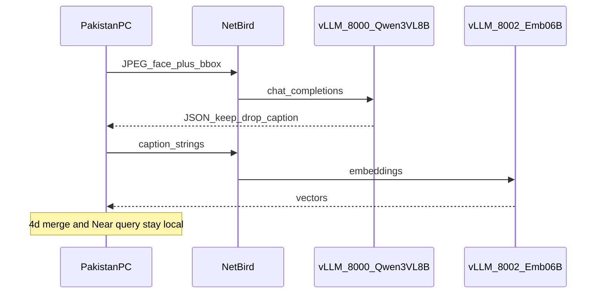

# HK `spatial-gpt` — brief for the remote Cursor agent

This plan is written so a **Cursor agent SSH'd into the HK box as `kodifly`, cwd `/home/kodifly`**, can build the stack from zero. It does **not** run Stella/SAM3/Phase 3. Those stay on the Pakistan PC. This box is only **caption VLM + text embedder**.

Do **not** clone Decoupled-FARM or FARM-Project onto this machine. Copy the prompts, schema, and vocab below into `spatial-gpt`. Weights go to the default Hugging Face cache (`~/.cache/huggingface`).

---

## 0. What this replaces / what not to copy

A previous service on this box was:

- FastAPI `vlm-api-qwen25vl.service` on **port 8090**
- `Qwen/Qwen2.5-VL-7B-Instruct`
- `POST /analyze_video` with an mp4, keyword YES/NO
- `asyncio.Semaphore(1)`, no auth, bind `0.0.0.0`

**Do not extend that welding API.** New stack is **vLLM**, OpenAI-compatible, **JPEG faces + JSON captions**, **batched**, **NetBird-only bind**, **API token**.

If `vlm-api-qwen25vl.service` (or any other GPU job) is loaded, **stop it** before serving. One 4090, 24 GB. `nvidia-smi` should be idle except this stack.

---

## 1. Hardware and network (use these numbers)

**GPU:** RTX 4090 24 GB, driver 575, CUDA 12.9. One card.

**NetBird (this is the overlay — not ZeroTier, not public WAN):**

| Host | Role | NetBird IP | FQDN |
|------|------|------------|------|
| This box | GPU server | **`100.109.254.4`** | `spatialx-backend-hk-office-kodifly-z790-aorus-elite-ax.netbird.cloud` |
| Pakistan PC | Pipeline client | `100.109.101.169` | `sarim-pc.netbird.cloud` |

Both are `100.109.0.0/16`. NetBird DNS is **not** configured (`Nameservers: 0/0`). Clients must use **`http://100.109.254.4:<port>`**, not the FQDN.

**Bind:** `--host 100.109.254.4` only. Do **not** bind `0.0.0.0`. Do **not** port-forward 8000/8002 on the office router.

**Auth:** vLLM `--api-key` from `spatial-gpt/.env` (`VLLM_API_KEY`). Same key on both ports. Client sends `Authorization: Bearer <key>`.

**Firewall:** allow TCP 8000 and 8002 from `100.109.0.0/16` (and localhost). Nowhere else.

**Sanity from this box:**

```bash
netbird status   # Connected, IP 100.109.254.4
ping -c 3 100.109.101.169   # optional, Pakistan peer
```

---

## 2. Target directory layout

Create **`/home/kodifly/spatial-gpt`**:

```text
/home/kodifly/spatial-gpt/
  README.md
  .env.example          # VLLM_API_KEY, HF_TOKEN (no secrets committed)
  .env                  # gitignored; generate a random API key
  prompts/
    caption_system.txt          # exact Phase 4 caption system prompt
    caption_user_template.txt   # user-turn template
    query_parser_system.txt     # optional text-only parse
    caption_schema.json         # guided JSON schema
  data/
    construction_vocab.txt      # 48-line site vocab (copy verbatim)
  scripts/
    serve_vlm.sh
    serve_embed.sh
    smoke_caption.py
    smoke_embed.py
  systemd/                      # optional units
```

Python venv or uv under `spatial-gpt/.venv` is fine. Install **vLLM** with CUDA matching 12.x. Do not use TensorRT-LLM for v1.

---

## 3. Models to deploy (exactly two)

| Role | Hugging Face id | vLLM served name | Port | GPU mem |
|------|-----------------|------------------|------|---------|
| Caption VLM | `Qwen/Qwen3-VL-8B-Instruct` | `qwen3-vl-8b` | **8000** | ~0.70 util |
| Text embed | `Qwen/Qwen3-Embedding-0.6B` | `qwen3-emb-0.6b` | **8002** | ~0.12–0.15 util, `--runner pooling` |

**Do not** also load Qwen3-VL-Embedding-2B, SigLIP2, or Qwen3.5-9B. They will not fit with the 8B VL.

**Quantization (user intent: INT8 instead of FP16):**

1. Try **FP8 first** — 4090 (Ada) has native FP8; vLLM `--quantization fp8` (or an official FP8 checkpoint if listed on the model card). Quality ≈ INT8, usually faster on this GPU.
2. If FP8 fails to load: **weight-only INT8 / compressed-tensors W8A16**, or a published **AWQ** of this model. Keep the **vision tower in FP16** if the loader allows it (bbox targeting degrades if ViT is mashed).
3. Last resort: FP16 8B VL **alone** (no embedder co-resident). Then run embedder only when VL is stopped — not acceptable for production; fix quant instead.

Vision encoder FP16 + LLM INT8/FP8 is the quality bar for “full 504×504 face + `<box>`”.

**vLLM flags (starting point, tune if OOM):**

Caption (`serve_vlm.sh`):

- `--host 100.109.254.4 --port 8000`
- `--served-model-name qwen3-vl-8b`
- `--dtype auto` + quant as above
- `--max-model-len 4096` (faces are 504×504; do not use 32k)
- `--max-num-seqs 8` (batch 8 images; not Semaphore(1))
- `--gpu-memory-utilization 0.70`
- `--limit-mm-per-prompt image=1` (or current vLLM mm equivalent)
- `--api-key "$VLLM_API_KEY"`
- Disable thinking if the model emits `<think>` (chat template / `enable_thinking=false` if supported)

Embed (`serve_embed.sh`):

- `--host 100.109.254.4 --port 8002`
- `--served-model-name qwen3-emb-0.6b`
- `--runner pooling`
- `--max-model-len 512`
- `--gpu-memory-utilization 0.15`
- `--api-key "$VLLM_API_KEY"`

Download weights with `huggingface-cli` / `vLLM` into default HF cache. If the repo is gated, use `HF_TOKEN` from env (operator provides it; do not hardcode).

Record the **embedding dimension** in README (Qwen3-Emb-0.6B is typically **1024**, not Gemini’s 768). Pakistan client already accepts any dim ≥ 128.

---

## 4. API contract (what Pakistan will send)

OpenAI-compatible. No custom `/analyze_video`.

### 4b Caption — `POST http://100.109.254.4:8000/v1/chat/completions`

**Image:** one **JPEG**, typically **504×504** cuboid **face** (full perspective view), **not** a tight crop, **not** mp4, **not** equirect. ~40–80 KB.

**How the VLM is aimed:** user text includes FARM-style bbox in **normalized 0–1000**:

```text
TARGET BOUNDING BOX: <box>(x1,y1),(x2,y2)</box>
```

**Payload shape:**

```json
{
  "model": "qwen3-vl-8b",
  "temperature": 0.0,
  "max_tokens": 512,
  "response_format": { "type": "json_object" },
  "messages": [
    { "role": "system", "content": "<caption_system.txt>" },
    { "role": "user", "content": [
        { "type": "text", "text": "<caption_user_template with bbox>" },
        { "type": "image_url", "image_url": { "url": "data:image/jpeg;base64,..." } }
    ]}
  ]
}
```

Enable **guided JSON** (`extra_body` guided_json / `structured_outputs`) using `prompts/caption_schema.json` so the 8B model cannot ramble.

**Required output JSON (strict):**

```json
{
  "category": "string",
  "supercategory": "string",
  "attributes": ["string"],
  "description": "string",
  "decision": "keep"
}
```

`decision` is only `"keep"` or `"drop"`. On drop, exactly:

```json
{"category":"unknown","supercategory":"unknown","attributes":[],"description":"","decision":"drop"}
```

Client may send **batches of independent HTTP requests**; vLLM continuous batching handles concurrency. Do **not** serialize with a global semaphore of 1.

### 4c Embed — `POST http://100.109.254.4:8002/v1/embeddings`

```json
{ "model": "qwen3-emb-0.6b", "input": ["blue corrugated shipping container", "..."] }
```

Input is **caption text only** (the `description` field, optionally `"category. description"`). No images.

Optional query-time: same endpoint, one short string (`target_description`).

### Optional query parse — same port 8000, **text only** (no image)

Use `query_parser_system.txt`. Pakistan may keep parsing local; still ship the prompt on this box so both sides match.

---

## 5. Prompts and data to put on disk (copy verbatim)

These are the Decoupled-FARM Phase 4 assets. Compliance with FARM Phase 4 **for our construction use** means these files, not Qwen’s default chat prompt.

### 5.1 `prompts/caption_system.txt`

Copy the full `CAPTION_SYSTEM_PROMPT` from [Decoupled-FARM/phase4-visual-query/prompts.py](/home/kodifly/Desktop/farm-git/Decoupled-FARM/phase4-visual-query/prompts.py) (the long construction-site annotator block: keep/drop rules, supercategories, JSON schema, four examples).

Supercategories allowed: `heavy equipment, temporary works, container, vehicle, structure, material, PPE, tool, fixture, signage, vegetation, safety equipment, other, unknown`.

### 5.2 `prompts/caption_user_template.txt`

```text
NEW INPUT:
INPUT VIEWS: 1 full perspective view of the construction site.
Image size: {width}×{height} pixels.
TARGET BOUNDING BOX: {bbox_tag}
Identify the target object inside the bounding box on this construction site.
Preferred site vocabulary (when confident): {vocab_hint}

Return the strict JSON object only.
```

`bbox_tag` example: `<box>(120,80),(410,390)</box>`  
Default `{width}`×`{height}` = `504×504`.  
`{vocab_hint}` = first ~40 lines of `construction_vocab.txt`, comma-separated.

### 5.3 `prompts/caption_schema.json`

JSON Schema matching the keep/drop object (`category`, `supercategory` enum-or-string, `attributes` array, `description`, `decision` enum keep/drop). Use this for vLLM guided decoding.

### 5.4 `prompts/query_parser_system.txt`

From the same `prompts.py` `QUERY_PARSER_SYSTEM`. Supported predicates we actually execute: **Near, NextTo, Closest, Farthest, On, Above, Below, IsCategory, HasAttribute**. Do **not** advertise LeftOf/RightOf/InFrontOf (cuboid 360; those stay unimplemented).

### 5.5 `data/construction_vocab.txt` (entire file, 48 lines)

```
construction debris
debris
rubble
scrap metal
garbage pile
dumpster
metal rebar
rebar
steel rebar
rebar cage
metal rebar cage
reinforcing bar
reinforcement cage
metal steel beam
steel beam
metal beam
I-beam
steel girder
structural steel
steel column
pvc pipe
metal pipe
pipe
steel pipe
conduit
site container
shipping container
container
site office container
storage container
brick
bricks
brick pile
brick stack
water tanker
water truck
tanker truck
mobile crane
crane
truck
dump truck
trailer truck
concrete perimeter wall
perimeter wall
concrete wall
site wall
external wall
retaining wall
```

Vocab is a **hint** in the user prompt, not a closed class list. The VLM may output corrected categories.

---

## 6. What is **not** transferred to HK

Pakistan keeps: video, Stella `out.db`, DA3 depths, SAM3 packs, `scene_state.pt`, Phase 4a crops/faces, merge, viewer, QueryGraph **execution** (Near in XYZ).

HK never needs 7k images stored. Each caption request is **stateless**: image bytes in, JSON out.

---

## 7. Smoke tests the HK agent must pass

From **localhost on HK** (and then, if possible, from `100.109.101.169`):

1. `curl -H "Authorization: Bearer $VLLM_API_KEY" http://100.109.254.4:8000/v1/models` → lists `qwen3-vl-8b`
2. Same for `:8002` → `qwen3-emb-0.6b`
3. `scripts/smoke_caption.py`: POST one 504×504 JPEG + dummy bbox covering the center; print parsed JSON with `decision` in `{keep,drop}`
4. `scripts/smoke_embed.py`: embed `["blue corrugated shipping container"]`; print dim and L2-norm
5. Confirm `ss -tlnp` shows **100.109.254.4:8000** and **:8002**, not `0.0.0.0`
6. Confirm `nvidia-smi` both processes fit; no OOM

Document in README: expected caption latency (~0.3–2 s/image batched) and that Pakistan will send **batches of 8**, not one-at-a-time videos.

---

## 8. Ops

- systemd user or system units for `spatial-gpt-vlm` and `spatial-gpt-embed`, restart=on-failure, after `nvidia` + `netbird`.
- Logs to `journalctl` or `spatial-gpt/logs/`.
- README: start/stop, ports, NetBird IP, API key location, what **not** to run alongside (old 8090 Qwen, training).
- If NetBird is down, vLLM on 100.109.254.4 is unreachable from PK — that is intended.

---

## 9. Pakistan side (out of scope for the HK agent, for later)

Decoupled-FARM [phase4-visual-query/gemini_client.py](/home/kodifly/Desktop/farm-git/Decoupled-FARM/phase4-visual-query/gemini_client.py) will gain a vLLM backend: same `caption_image` / `embed_texts` interface, `VLLM_BASE_URL=http://100.109.254.4:8000/v1`, `VLLM_EMBED_BASE_URL=http://100.109.254.4:8002/v1`, `VLLM_API_KEY`. 4a/4d/query geometry stay local. Do not implement that on HK.

---

## Data flow

